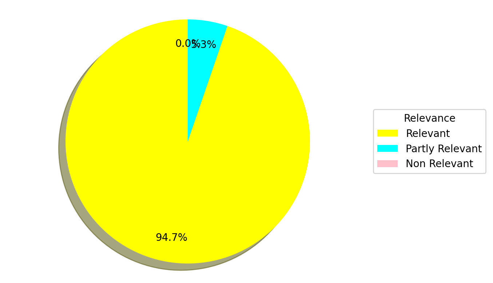

# Hack for LA Contributor Assistant

The [Hack for LA](https://www.hackforla.org) Contributor Assistant is an innovative chatbot designed to streamline the process of contributing to Hack for LA's open source projects. This AI-powered tool serves as a conversational interface, providing quick and accurate answers to questions about the contribution process.

## Project Overview  🚀

Our assistant leverages Large Language Model (LLM) technology and Retrieval-Augmented Generation (RAG) techniques to offer an intelligent, context-aware solution. By drawing information from Hack for LA's comprehensive [Contributing.md](https://github.com/hackforla/website/blob/gh-pages/CONTRIBUTING.md) document, it provides instant, relevant responses to contributors' queries.

Key features include:

1. Natural language interaction for easy querying
2. Data-driven responses sourced directly from official documentation
3. Relevance scoring for each response
4. Query history logging
5. Visual data representation through pie charts, showcasing:
   - User voting on response quality
   - Overall relevance of responses

This tool is particularly valuable for new contributors, especially aspiring software engineers, who may find navigating extensive documentation time-consuming. By offering a more efficient way to access information, the Contributor Assistant aims to lower the barrier to entry and encourage more active participation in Hack for LA's open source community.


## Data Source and Processing 🧱

The core of our assistant's knowledge is built upon Hack for LA's comprehensive Contributing.md document. This rich source of information undergoes a sophisticated transformation process:

1. Data Extraction: We extract crucial information covering the full spectrum of contribution guidelines.

2. Semantic Segmentation: The content is intelligently divided into meaningful chunks, preserving context and relationships between different sections.

3. Embedding Generation: Using advanced natural language processing techniques, we generate high-dimensional embeddings for each segment, capturing the semantic essence of the information.

4. Indexing for Rapid Retrieval: These embeddings are indexed using efficient algorithms, enabling lightning-fast retrieval during query processing.

5. Dynamic Integration: Our system continuously updates its knowledge base, ensuring the assistant always provides the most current information.

This meticulous data preparation process enables our LLM RAG system to deliver highly relevant and context-aware responses, significantly enhancing the user experience for Hack for LA contributors.


## Technologies 🖥

Our Hack for LA Contributor Assistant leverages a robust and modern technology stack:

- **Python 3.12:** The core programming language, providing a solid foundation for the entire application.

- **Docker and Docker Compose:** Ensures consistent environments and simplifies deployment across different systems.

- **Elasticsearch:** Enables efficient vector search capabilities, allowing for semantic similarity matching using the embedded representations of our knowledge base.

- **PostgreSQL:** Reliable relational database for storing structured data and query logs.

- **Anthropic's Claude AI (Claude 3.5 Sonnet and Claude 3 Haiku):** Advanced language models driving the assistant's natural language understanding and generation capabilities.

- **Streamlit:** Creates an intuitive and interactive web interface for users to engage with the assistant.

- **sentence-transformers:** Generates high-quality vector embeddings from text, capturing semantic meaning for improved search accuracy.

- **pandas:** Facilitates data manipulation and analysis for generating insights.

- **LangChain:** Provides the Markdown Text Splitter for processing documentation and enables hybrid search techniques, combining text and vector-based approaches.

- **matplotlib:** Generates visual representations of data, including the pie charts for user feedback and response relevance.

This carefully selected stack combines powerful tools and libraries to create a responsive, intelligent, and user-friendly assistant for Hack for LA contributors.


## Instructions to Replicate the Project 🧭

1. Clone me:
   ```
    git clone https://github.com/agutiernc/contributor_assistant
   ```

2. Switch to project directory

   ```
   cd contributor_assistant
   ```


### Stage 1: Data Preparation and Testing (Optional)

This stage is optional, but provides insight into the data preparation and testing process. Skip to Stage 2 to run the Streamlit app.

**Note:** This step will generate the files that are located in the `data` directory, except for `CONTRIBUTING.md`. You can delete those files if you plan to run the Jupyter Notebooks.

#### Environment Setup

1. Create a Python virtual environment in your terminal:

   ```
   python -m venv venv
   ```

2. Activate the virtual environment:

   ```
   source venv/bin/activate
   ```

3. Install dependencies:

   ```
   pip install -r requirements.txt
   ```

4. Add your Anthropic Claude API Key to your terminal:
   ```
   export ANTHROPIC_API_KEY="your_api_key"
   ```

    **Note:** An Anthropic API Key is required. Get one from [here](https://www.anthropic.com/api). ([Pricing](https://www.anthropic.com/pricing#anthropic-api))


### Parsing and Chunking the Data Source

1. In your terminal, with the virtual environment activated, start Jupyter Notebook:

   ```
   jupyter notebook
   ```

   **Note**: Your default web browser will open, displaying the Jupyter Notebook interface.

2. Navigate to and open the `parse_markdown_to_json.ipynb` file.

3. To run the notebook:
   - To execute all cells: Click `Cell` in the top menu, then `Run All`.
   - To run an individual cell: Select the cell and press `Ctrl + Enter`, or click the "Run" button in the toolbar.

This notebook performs the following tasks:
- Parses the `contributing.md` file from the `data` directory
- Uses LangChain's *MarkdownHeaderTextSplitter* to divide the content into manageable chunks
- Outputs the processed data as a *JSON* file for further use in the pipeline


### Generating Ground Truth Data

This step creates a benchmark dataset to evaluate and fine-tune our chatbot's performance. It requires an Anthropic API key, as mentioned earlier.

1. In Jupyter Notebook, open `generate_ground_truth_data.ipynb`
2. Run the cells as instructed previously

The notebook accomplishes the following:

- Processes the `documents.json` file from the earlier step
- Uses Claude AI to generate potential user questions based on the source data
- Produces a *CSV* file containing these questions and their corresponding document IDs

This ground truth dataset enables us to assess and enhance the chatbot's accuracy in providing contextually appropriate responses.


### RAG Development and Testing

1. In Jupyter Notebook, open `rag_test.ipynb`
2. Run the cells as instructed previously

This crucial file develops and tests our LLM RAG system:

  - Vector Embeddings: We create these using SentenceTransformer and ElasticSearch. Think of them as numerical representations of text that capture semantic meaning, allowing for efficient similarity searches.
  - Hybrid Search: We implement multiple approaches, including one using LangChain's ElasticsearchRetriever. Hybrid search combines traditional keyword search with vector similarity search, aiming for more accurate and contextually relevant results.

Key steps involved:
1. Index and embed documents from `documents.json`
   
2. Test three hybrid search configurations
   
3. Implement [Reciprocal Rank Fusion](https://carbon.ai/blog/reciprocal-rank-fusion) (RRF) in hybrid search
   - RRF combines results from multiple ranking systems, improving overall search quality
  
4. Evaluate using [hit rate](https://www.analyticsvidhya.com/blog/2024/07/hit-rate-mrr-and-mmr-metrics) and [Mean Reciprocal Rank](https://en.wikipedia.org/wiki/Mean_reciprocal_rank) (MRR) scoring
   -  Our best configuration achieved: `Hit Rate: 89.67%, MRR: 71.91%`
  
5. Fine-tune the RAG flow for optimal AI responses
   
6. Conduct RAG Evaluation (sample size = 100 records) using:
   - Claude 3.5 Sonnet as a Judge (thorough evaluation)
     - 89% Relevant
     - 10% Partly Relevant
     - 1% Non-Relevant
   - Claude 3 Haiku as a Judge (efficient and cost-effective)
     - 99% Relevant
     - 1% Partly Relevant
     - 0% Non-Relevant
  
1. Utilize `ground-truth-retrieval.csv` for comprehensive evaluation

2. Use `CTRL + C` to end Jupyter Notebook session in the terminal, but *keep the terminal tab open*.

This rigorous testing process demonstrates our commitment to creating a high-performance, accurate chatbot system, showcasing advanced NLP techniques and thorough evaluation methodologies.

---

### Stage 2: Running the Chatbot App

After replicating the project, follow these steps to set up and run the Streamlit app:

### Prerequisites
- Ensure Docker is installed on your system.

### Setup Steps
1. Open a new terminal tab and navigate to the app directory:
   ```
   cd app
   ```

1. If needed, set the Postgres host:
   ```
   export POSTGRES_HOST=localhost
   ```

2. Prepare the environment file:
   - Rename `.env-doc` to `.env`
   - Add your information to the environment variables in `.env`

3. Run the Docker container:
   ```
   docker compose up
   ```

4. Switch back to the first terminal tab (where you ran Jupyter Notebook).

5. Change to the `app` directory and run the preparation script:
   ```
   cd app

   python prep.py
   ```

   This script will:
   - Fetch relevant documents from the `data` directory
   - Set up Elasticsearch and index the documents
   - Configure PostgreSQL tables using the `db.py` database config script

6. (Optional) Verify the database setup:
   ```
   pgcli -h localhost -U your_username -d contributor_assistant -W
   ```
   - Replace `your_username` with the value you used for `POSTGRES_USER` in `.env`.
   - Use the `POSTGRES_PASSWORD` from your `.env` file when prompted
   - Once connected, you can run:
     - `\d conversations;` to see the schema
     - `\dt;` to list all tables
     - `SELECT * FROM conversations;` or `SELECT * FROM feedback;` to view table contents

7. Launch the chatbot app:
   - Open your web browser and go to `http://localhost:8501`

You should now see the chatbot app loaded and ready to use.

---

### Monitoring and Evaluation

The chatbot's performance is monitored using two key metrics, visualized through pie charts:

1. Query Relevance:
   This chart displays the distribution of queries categorized as relevant, partly relevant, or non-relevant. It helps assess how well the chatbot understands and responds to user inputs.

2. Helpfulness:
   The second chart shows the proportion of queries deemed helpful or not helpful. This metric directly measures the chatbot's effectiveness in assisting users.





These visualizations are crucial for:
- Identifying areas for improvement
- Tracking the chatbot's performance over time
- Ensuring the chatbot meets user needs effectively

By monitoring these metrics, we can continuously refine the chatbot's responses and enhance its overall quality and usefulness.

---

Thanks to [DataTalk's Club LLM Zoomcamp](Zoomcamp) for their excellent course and for giving me the knowledge on LLM/RAG.